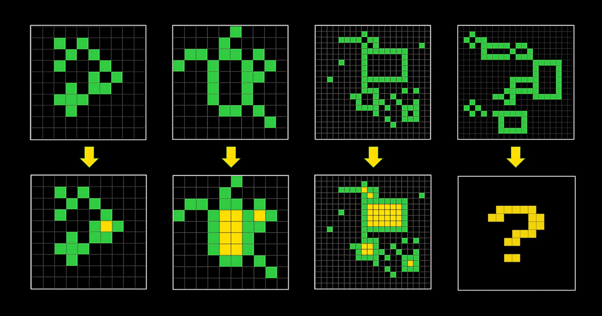
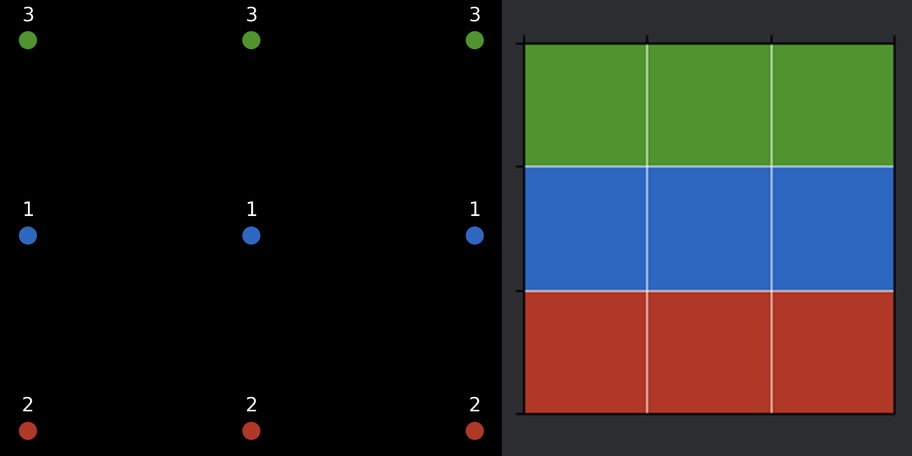
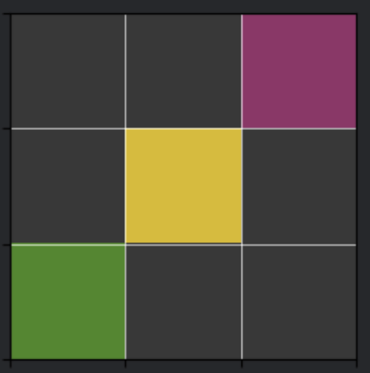
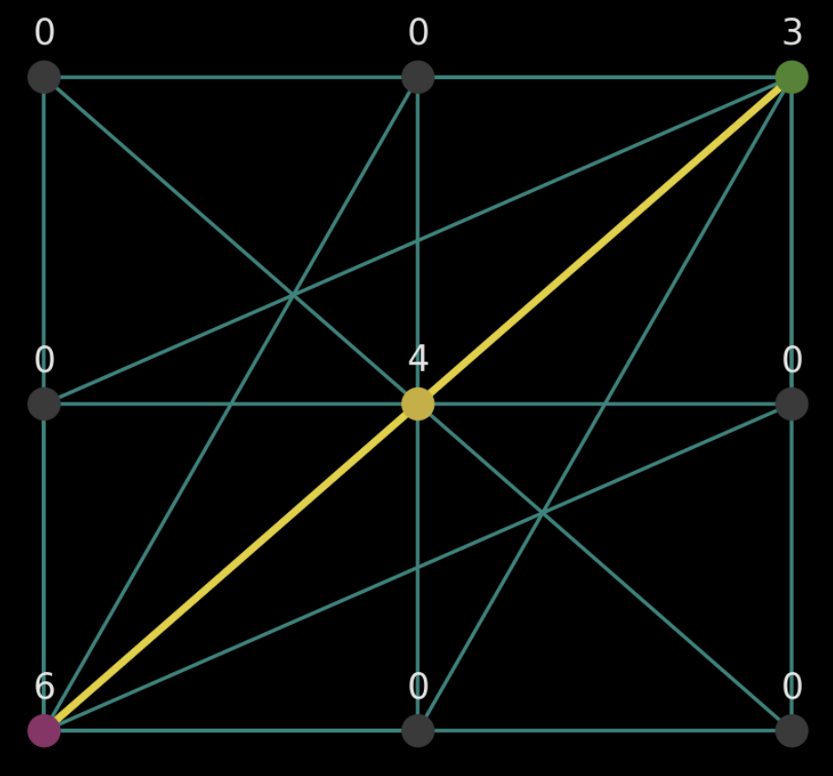
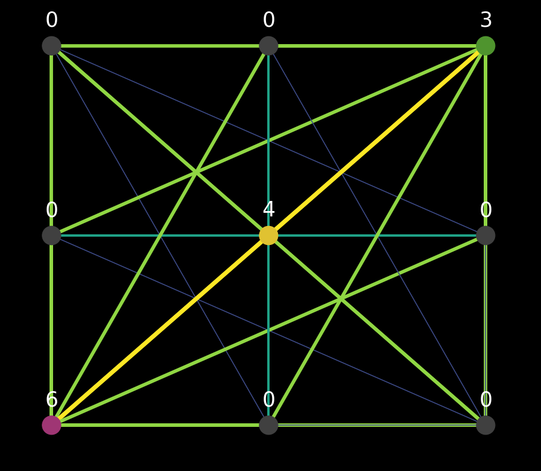
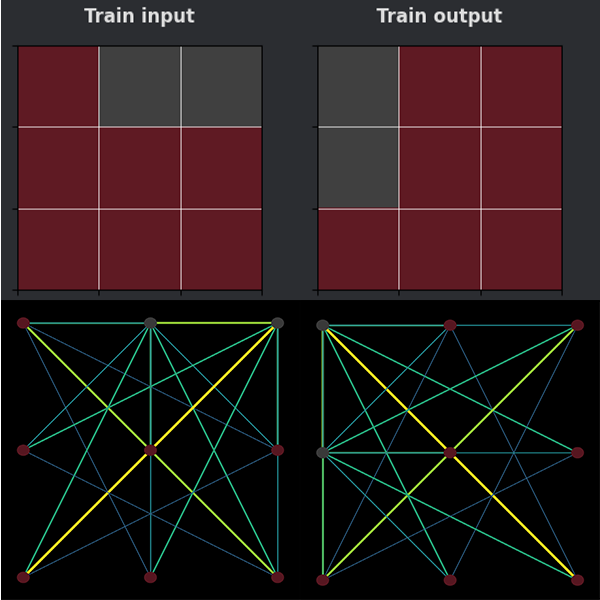
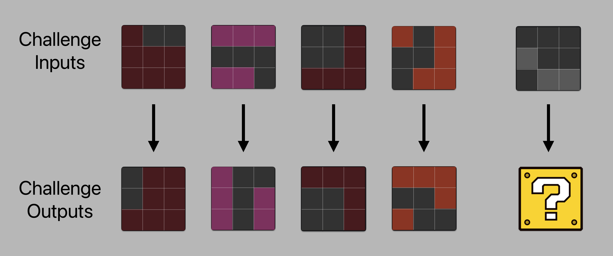
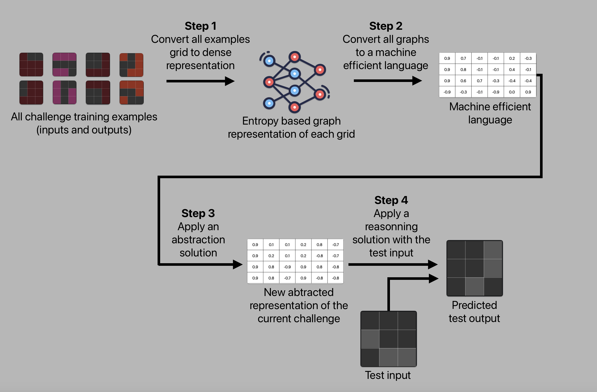

# Entropy based dense representation of ARC tasks

## summary

1. [Introduction](#introduction)
2. [What is ARC-AGI?](#what-is-arc-agi)
3. [What is entropy?](#what-is-entropy)
4. [How entropy was used to ARC?](#how-entropy-was-used-to-arc)
5. [What do to based onto the dense representation?](#what-do-to-based-onto-the-dense-representation)
6. [Limitations](#limitations)
7. [Codebase](#codebase)
8. [Conclusion](#conclusion)

## Introduction

The Abstraction and Reasoning Challenge (ARC) is an exciting challenge due to its novelty, its difficulty, and the promising perspectives it offers toward a new form of artificial intelligence. The objective of this research paper is to propose a more information-rich foundation compared to existing approaches, with the aim of enhancing machines' ability to solve ARC tasks by leveraging participants' methods.

The proposed method is based on representing tasks as graph structures. This approach is inspired by the Latin etymology of the word ‘intelligo, is, ere,’ meaning ‘to understand.’ In analyzing its semantics, ‘intelligo’ refers to ‘linking between’ or ‘making connections,’ which aligns with how this method seeks to connect information to better capture the complex relationships present in the ARC dataset. By using the notion of entropy as defined by Claude Shannon, this representation evaluates the originality and diversity of connections between nodes, thus making the modeling richer and more meaningful.

Ultimately, this research proposes a new foundation that could potentially enhance the performance of solutions by providing a more comprehensive structure capable of capturing complex information and increasing the ability of machines to understand and solve the challenges posed by ARC.

## What is ARC-AGI?

ARC-AGI (Abstraction and Reasoning Corpus for Artificial General Intelligence) is a benchmark that evaluates AI's ability to solve novel, abstract problems—key aspects of general intelligence according to ARC creators.

Unlike traditional benchmarks, ARC-AGI tests how well AI can generalize to new tasks, focusing on abstraction, reasoning, and pattern recognition through grid-based puzzles.

    
    
A basic task example from the Abstract and Reason Corpus

> Source: [arc-agi website](https://arcprize.org)

## What is entropy?

The notion of entropy can take on different meanings depending on the field. Naturally, the context here leads us to use the definition of entropy from Claude Shannon, also known as the "father of information theory".

Here is the formula for Shannon's entropy:

$$
H(X) = -\sum\limits_{i=1}^{n} P(x_i) \log_2 P(x_i)
$$

- $ H(X) $ : The entropy of the random variable $ X $.

- $ \sum\limits\_{i=1}^{n} $ : The summation over all possible outcomes $ x_i $ from 1 to $ n $.

- $ P(x_i) $ : The probability of outcome $ x_i $.

- $ \log_2 P(x_i) $ : The base-2 logarithm of the probability of outcome $ x_i $.

 

### Explanation

The entropy of a random variable quantifies the average level of uncertainty or information associated with the variable's potential states or possible outcomes. This measures the expected amount of information needed to describe the state of the variable, considering the distribution of probabilities across all potential states.

- Following youtube video explains more in details what Shannon entropy is: [Intuitively Understanding the Shannon Entropy](https://www.youtube.com/watch?v=0GCGaw0QOhA)

- Wikipedia: [Entropy (information theory)](<https://en.wikipedia.org/wiki/Entropy_(information_theory)>)

## How entropy was used to ARC

I will show you how I have used this fundamental principle of information theory to build a denser representation of ARC-AGI problems than the original one.

As the saying goes, knowledge is power, and the challenge imposed by ARC tasks is precisely to limit the amount of information (and thus power) we have. This is mainly achieved by providing a very small number of examples per challenge, and we will not question this, as it is the core of the challenge. This constraint should push us to move beyond conventional machine learning approaches (especially deep learning) that aim to generalize over a very large number of examples.

However, this does not prevent us from amplifying the limited information available for each problem, which is not only a viable strategy but also an essential one.

If we have fewer data (than in conventional machine learning problems) to solve each task, it is crucial to compensate with more computation. What this challenge aims to create is not a simple task; it involves complex reasoning, and I believe it is unprecedented in the history of computing. Therefore, I think we need to think big, far, and beyond the current state of the art, even detaching ourselves from it somewhat to offer something new.

We will see later that the approach proposed here serves as a foundation for solving ARC; it is a way to represent the problems. This representation aims to express each puzzle in a denser manner than initially presented.

### Application

The approach is graph-oriented, where each colored cell of a board (or grid) corresponds to a node. As we will se later, the graph representation is complete and undirected. Thus, each node is connected once to every other node. The following image highlights a board from an ARC task but without any connection yet so you can understand the fundamentals.

 

 
    
    
Basic graph representation versus it's real board (or grid)

 

It is therefore about converting a board into a graph. For example, if a problem consists of 2 training examples and 1 test example, this results in $ 2 \* 2 + 1 = 5 $ graphs. Quick maths...

#### What about the edges?

This is where we will exploit entropy.

Each connection between two nodes is associated with an entropy value, calculated based on the distribution of connections in the graph. This entropy is measured for each triplet (node value, connected node value, distance between nodes).

This triplet is the data that influences the calculation of entropy and thus the representation of the graph. Different representations can be chosen.

It is also possible to choose to calculate the rarity of the connections based on:

- only the value of the two connected nodes,
- other metrics of your choice that can increase the amount of information in the graph.

The more information added, the more each connection should be unique compared to others, but this is not necessarily a good idea, as we will see. The choice of information used to calculate the distribution can make explaining certain problems more difficult.

To explain how entropy is calculated, let us get an example grid from a task of the ARC dataset:

 

    
    
Grid sample from task 'd037b0a7'

 

Below is the distribution of edges based on the color of the nodes they connect. If you do not immediately understand what the edges in question are about, the following images will surely help you better understand.

(🔳 = dark, for contrast purposes)

- 🟩-🔳 = 🔳-🟩 : 6 connections
- 🟨-🔳 = 🔳-🟨 : 6 connections
- 🟪-🔳 = 🔳-🟪 : 6 connections
- 🟩-🟨 = 🟨-🟩 : 1 connection
- 🟪-🟨 = 🟨-🟪 : 1 connection
- 🟪-🟩 = 🟩-🟪 : 1 connection
- 🟩-🟩 : 0 connections
- 🟪-🟪 : 0 connections
- 🟨-🟨 : 0 connections
- 🔳-🔳 : 15 connections

The total number of connections in a complete graph can be calculated using the formula for the number of edges in a complete graph: $\frac{n \times (n - 1)}{2}$, where $n$ is the number of nodes. In this case, with 9 nodes, the total number of connections is $(9 \times (9 - 1)) / 2 = 36$.

To calculate the entropy of each line, we use Shannon's entropy formula:

$$
H(X) = -\sum_{i=1}^{n} p_i \log_2(p_i)
$$

This formula was alreadu explained in the [dedicated section](#what-is-entropy)

### Step 1: Calculating Probabilities

For each type of connection (e.g., 🟩-🔳 = 🔳-🟩), we divide the number of connections by the total number of connections.

### Step 2: Calculating Entropy

Using the probabilities calculated in the previous step, we apply the entropy formula for each line.

### Step 3: Inverted normalization of entropies

Final step implies to invert values and normalies them using below formula:

$$
\text{normalized entropy} = 1 - \frac{H - H_{\text{min}}}{H_{\text{max}} - H_{\text{min}}}
$$

### Probability Calculation

🟩-🔳 = 🔳-🟩 : $$ p = \frac{6}{36} = \frac{1}{6} $$

🟨-🔳 = 🔳-🟨 : $$ p = \frac{6}{36} = \frac{1}{6} $$

🟪-🔳 = 🔳-🟪 : $$ p = \frac{6}{36} = \frac{1}{6} $$

🟩-🟨 = 🟨-🟩 : $$ p = \frac{1}{36} $$

🟪-🟨 = 🟨-🟪 : $$ p = \frac{1}{36} $$

🟪-🟩 = 🟩-🟪 : $$ p = \frac{1}{36} $$

🟩-🟩 : $$ p = \frac{0}{36} = 0 $$

🟪-🟪 : $$ p = \frac{0}{36} = 0 $$

🟨-🟨 : $$ p = \frac{0}{36} = 0 $$

🔳-🔳 : $$ p = \frac{15}{36} \approx 0.4167 $$

### Entropy Calculation

$$ H(\text{🟩-🔳}) = -\frac{1}{6} \log_2\left(\frac{1}{6}\right) \approx 0.4308 $$

$$ H(\text{🟨 🔳}) = -\frac{1}{6} \log_2\left(\frac{1}{6}\right) \approx 0.4308 $$

$$ H(\text{🟪-🔳}) = -\frac{1}{6} \log_2\left(\frac{1}{6}\right) \approx 0.4308 $$

$$ H(\text{🟩-🟨}) = -\frac{1}{36} \log_2\left(\frac{1}{36}\right) \approx 0.1436 $$

$$ H(\text{🟪-🟨}) = -\frac{1}{36} \log_2\left(\frac{1}{36}\right) \approx 0.1436 $$

$$ H(\text{🟪-🟩}) = -\frac{1}{36} \log_2\left(\frac{1}{36}\right) \approx 0.1436 $$

$$ H(\text{🟩-🟩}) = 0 (because = 0 ) $$

$$ H(\text{🟪-🟪}) = 0 (because = 0 ) $$

$$ H(\text{🟨-🟨}) = 0 (because = 0 ) $$

$$ H(\text{🔳-🔳}) = -\frac{5}{12} \log_2(\frac{5}{12} ) \approx 0.5262 $$

### Inverted normalization

🔳-🟩: 0.1813

🔳-🟨: 0.1813

🔳-🟪: 0.1813

🟨-🟩: 0.7271

🟪-🟨: 0.7271

🟩-🟪: 0.7271

🟩-🟩: 1.0000

🟪-🟪: 1.0000

🟨-🟨: 1.0000

🔳-🔳: 0.0000

After an inverted normalization, the small entropies are highlighted since they represent the relationships that provide the most information. In the graphical representation, the rarest relationships are the brightest and thickest. Conversely, the relationships that provide less information (recurrent ones) are darker and thiner.

Here is what it looks like graphically for the previous example:

 

    
    
 Entropy based representation graph network with 1 rule being edges distribution (still task 'd037b0a7')

  

And here’s what it looks like if we include the characteristic of distance between the two points inside the distribution computation. In this case, it is the Manhattan distance, which I find suitable for grids like those encountered in ARC problems.

 

    
    
Entropy based representation graph network with 2 rule being edges distribution and manhattan distance between nodes (still task 'd037b0a7')

  

However, it is noticeable that this approach treats the connections 🟣-🟡, 🟢-🟣, and 🟡-🟢 in the same way. Although these three connections are equally rare, they do not necessarily provide the same information. This could be seen as one of the limitations of this approach. In this example, it does not seem to be a significant issue, but what about in other cases? Given that the ARC challenge requires the solution to be capable of solving ever-changing problems, one might wonder if this way of representing the problems could become limiting in certain situations. If so, in which cases? I have not found any clear constraints so far.

By adding information, we logically observe a higher level of information regarding the edges: four levels compared to two levels in the representation that does not implement the distances between the nodes. It is interesting to consider the quality of the values.

Here is an interesting example that shows how the characteristics of parallelism are well captured using distance.

 

    
    
Capturing parallelism in networks: comparing input and output nodes (task 'ed36ccf7')

 

Sometimes it is much more difficult, even too difficult, to interpret the representations, but I believe it remains a completely coherent representation. When looking at a single board, it may look nice, but it is not very useful.

That is why I think it is important to manipulate all the examples of a given problem at once and not to treat all of them separately. Moreover, since there are very few examples in each task, which is the very principle of the ARC challenge, the difficulty for the machine lies in understanding the relationships that characterize each example (input/output) from each other.

## What do to based onto the dense representation?

Well, if I have not implemented any solution based onto this representation yet, I had some thoughts I would like to share.

Let's assume the below basic task as a base example. Answer being a 90° anti-clockwise rotation, you will guess the answer to this test.

    
    
Task 'c9e6f938' from ARC dataset

 

The graph below presents a sequence of steps involving the use of entropy-based dense representation.

    
    
Solution architecture suggestion based on entropy based representation

 

Comments about the architecture:

1. First step is the entropy based representation computation. All training grids are independantly converted to entropy based graphs. Output of this step are 8 graph networks in the above example.
2. In step two, I suggest to convert those graph networks in a more machine efficient language such as embeddings. Graph embeddings can be done in many ways such as focusing on nodes only, edges only or both. This step calculates as many representations as there are graphs.
3. Step 3 is about applying a solution (to be found) to abstract the problem logic/rules from the graph network embeddings obtained thanks to previous steps. The output could also be embeddings, called problem language. This step looks for catching the problem caracteristics by focusing on graphs similarities. It is not meant to solve the problem yet, unlike the next step.
4. Last step is about finding a 'reasoning' solution which is able to generate a submission attempt (test output grid) based onto the test input and the problem language.

Since step 3 and 4 are to be determined, those steps could also be merged into a single step, but that are details.

As you may notice, no machine learning model is specified in this approach. This does not mean that one should not be used, but rather that I am not taking a stance on this aspect. However, it seems essential to implement a model in step 3 and/or 4, whether it is unsupervised, supervised, or hybrid.

## Limitations

### Sensitivity to computational explosion

In this small paper, we have only discussed small examples, so it may not be apparent, but the number of connections between nodes increases exponentially as the number of nodes increases. The following formula describes the number of edges as a function of the number of nodes, represented by the variable $ n $:

$$ {\displaystyle \sum _{i=1}^{n}\left(n-i\right)=\sum _{i=1}^{n-1}i={\frac {n(n-1)}{2}}} $$

The dominant term in this expression is $ n^2 $, so we can say that the complexity in terms of asymptotic growth is $ O(n^2) $.

However, achieving this type of intelligence through machines will likely require significant computational resources. The history of computing has repeatedly shown that certain ideas only become efficient once sufficient computation power is available.

Nevertheless, optimizations are already possible, such as parallelizing the computations of each grid in a task using graph networks.

### Sensitivity to entropy based rules

Depending on the rules that determine the entropy value of the links, certain information is favored. The expression of the representation is very dependent on the rules you choose to compute the entropy value of edges (such as distance).

In a sense, this gives you the freedom to characterize your representation as your imagination allows.

### Entropy

As shown by the example of task "d037b0a7" in the [Application](#application) section, some edges may stand out due to their rarity, but they will have the same entropy value even if they do not necessarily convey the same information in the given context. This largely depends on the constraints (or rules) applied. The observed limitation is more related to the distance rule than to the representation itself.

This is why my architecture proposes a solution that abstracts the problem's features by comparing all the associated grids. It is therefore crucial not to limit the analysis to the information extracted from a single grid, as all grids will express the problem in a similar manner, provided that the similarities that connect them are identified.

## Codebase

The codebase is available on GitHub via [this link](https://github.com/MaloLM/entropy-repr-for-arc-codebase) ⬅️⬅️⬅️

It provides the following features:

- Retrieve tasks from the dataset
- Display tasks
- Generate graphs of the grids
- Display graphs using Matplotlib

### Requirements

Developped and tested with Python 3.10

- matplotlib==3.9.2
- matplotlib-inline==0.1.7
- networkx==3.3
- numpy==1.26

## Conclusion

I am new to reasearch and I would be glad to have your feedbacks about this approach and this pseudo-paper. I realize this is an approach that can be seen as incomplete but see this as my humble contribution to the ARC challenge. For all that, if you have used this approach in your solution, please don't hesitate to share your results with me! It would make me feel involved and proud!

If you enjoyed this notebook, I would love your support!

- ⬆️ Upvote this notebook on Kaggle
- ⭐ Leave a star on the GitHub repo here to show your appreciation and keep the project growing!

Your feedback keeps me motivated and helps others avoid the same challenges.
